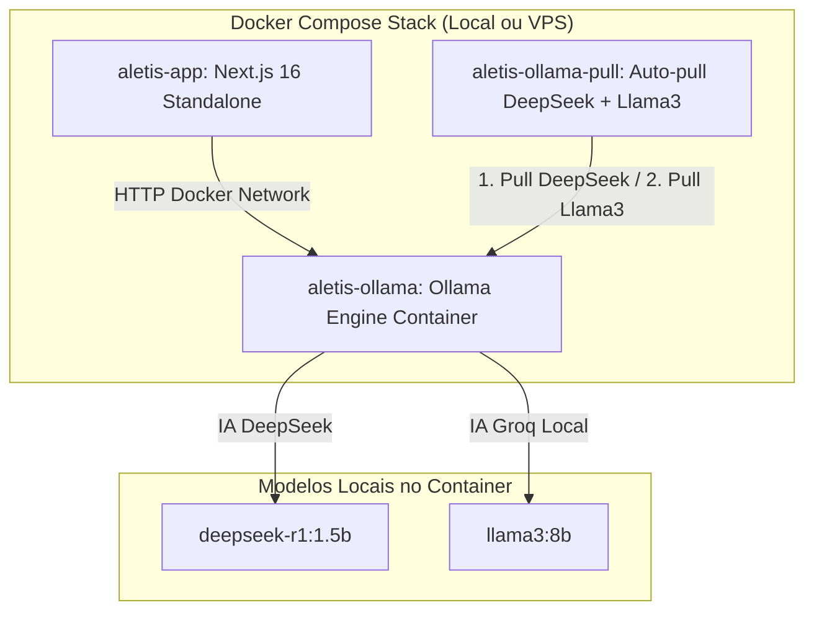

# 🛡️ Arquitetura Sentinela: Groq Local (Llama3) + DeepSeek + Ollama em Docker

> **Guardião da Economia de Atenção e Mentor do Aletis**  
> Documento oficial de arquitetura sistêmica 100% local containerizada com suporte duplo aos modelos **Groq (Llama 3)** e **DeepSeek**.

---

## 🏛️ 1. Visão Geral da Stack Docker Local

O **Sentinela** funciona 100% dentro do **Docker Compose**, eliminando qualquer dependência de APIs em nuvem, cartões de crédito ou serviços externos.

Dentro do container do Ollama, o sistema instala automaticamente:
1. **`deepseek-r1:1.5b`**: Modelo DeepSeek ultraleve para raciocínio e moderação local.
2. **`llama3:8b`**: O mesmo modelo de IA utilizado pelo **Groq**, rodando 100% localmente no Docker sem requisições externas.



---

## 🐳 2. Configuração no `docker-compose.yml`

```yaml
services:
  aletis-web:
    build:
      context: .
      dockerfile: Dockerfile
    container_name: aletis-app
    ports:
      - "3000:3000"
    environment:
      - OLLAMA_BASE_URL=http://ollama:11434
      - OLLAMA_MODEL=deepseek-r1:1.5b # Ou llama3:8b para o modelo do Groq
    depends_on:
      - ollama

  ollama:
    image: ollama/ollama:latest
    container_name: aletis-ollama
    ports:
      - "11434:11434"
    volumes:
      - ollama_data:/root/.ollama

  ollama-pull-model:
    image: curlimages/curl:latest
    container_name: aletis-ollama-pull
    depends_on:
      - ollama
    command: >
      sh -c "
        echo 'Baixando DeepSeek e Llama3 (Groq Local)...' &&
        curl -s http://ollama:11434/api/pull -d '{\"name\": \"deepseek-r1:1.5b\"}' &&
        curl -s http://ollama:11434/api/pull -d '{\"name\": \"llama3:8b\"}'
      "

volumes:
  ollama_data:
```

---

## ⚡ 3. Como Subir

Para inicializar todo o ecossistema (App + Groq Local + DeepSeek):

```bash
docker compose up --build -d
```

Nenhum comando manual adicional é necessário. O sistema baixa os modelos e conecta a moderação automaticamente.
