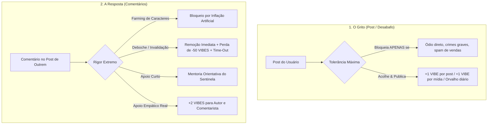
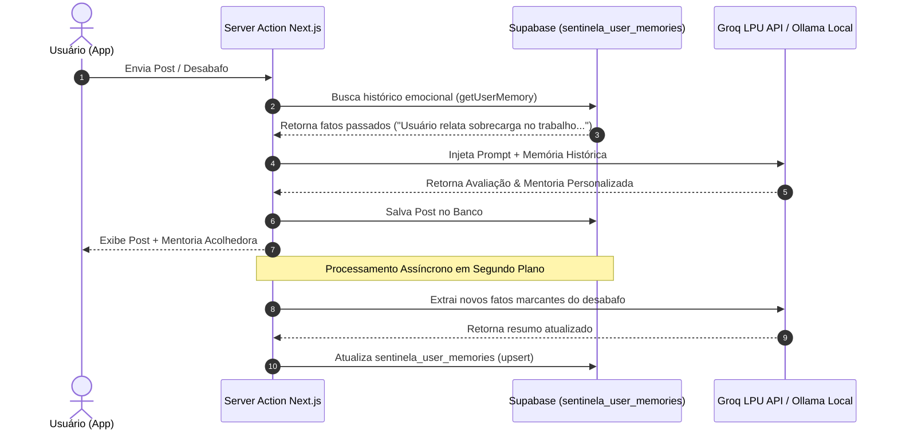
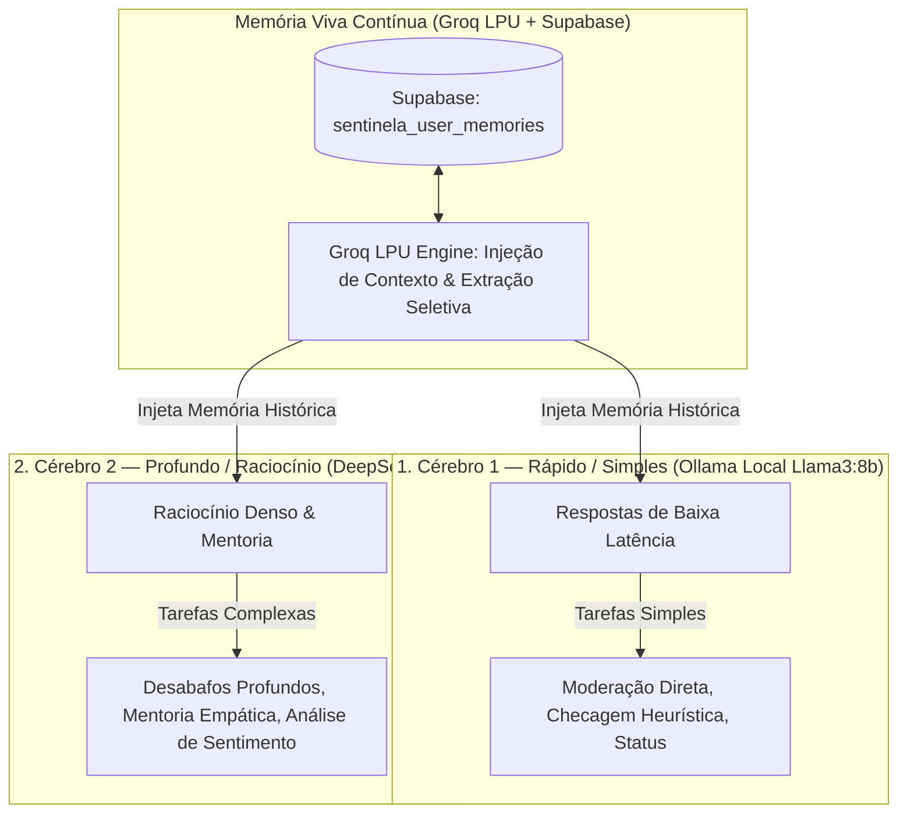

# 🛡️ Sentinela: O Guardião de Atenção e Mentor do Aletis

> **"O Grito (Desabafo) deve ser acolhido com o mínimo de barreiras. A Resposta (Comentário) deve ser cobrada com o máximo de empatia e qualidade."**

Documentação oficial de arquitetura sistêmica, filosofia de moderação, economia de VIBES, combate ao deboche e aprendizado de memória contínua do Sentinela.

---

## 🏛️ 1. A Filosofia Fundamental: O Grito vs. A Resposta

O **Aletis (Vibe)** é um porto seguro focado em saúde mental, escuta ativa e "Slow Tech". Para proteger quem está vulnerável sem criar barreiras à dor alheia, a moderação do Sentinela é dividida em duas réguas de rigor totalmente opostas:



---

## 💎 2. Economia de VIBES & Regras de Penalização

### A. Recompensa por Desabafo (O Grito)
- **+1 VIBE**: Concedida automaticamente ao publicar um desabafo autêntico no feed.
- **+1 VIBE Adicional**: Concedida se o usuário incluir uma imagem autêntica da sua realidade (ex: mesa caótica, janela, xícara).
- **6 VIBES de Orvalho Diário**: Energia renovável perecível por 24 horas distribuída aos usuários ativos para apoiarem outros membros.

### B. Regra dos Comentários (+2 VIBES)
- Comentários entre 100 e 200 caracteres de apoio empático e de alta qualidade rendem **+2 VIBES para o autor do comentário** e **+2 VIBES para o autor do post**.

### C. O Troll-Buster: Penalização por Deboche (-50 VIBES + Time-Out)
- Qualquer comentário com ironia, sarcasmo maldoso, desdém ou invalidação da dor alheia (ex: *"deixa de preguiça, é só arrumar a mesa"*) é **deletado instantaneamente pelo Sentinela** antes de aparecer na tela.
- **Penalização Imediata:** O agressor perde **-50 VIBES**.
- **Time-Out:** Se o saldo do usuário ficar negativo, ele entra em **Time-Out**. Todas as ações de comentar ou curtir são suspensas até que ele escreva um pedido de desculpas público no feed e a comunidade restabeleça seu saldo através de doações de Orvalho.

---

## 🧠 3. Arquitetura de Memória Contínua (Groq LPU + Supabase)

O Sentinela não esquece o contexto emocional dos membros. A cada interação, a memória contínua evolui através de um ciclo assíncrono de 4 fases:



---

## 🗄️ 4. Esquema de Banco de Dados (`sentinela_user_memories`)

```sql
-- Tabela de Memória de Longo Prazo do Sentinela
CREATE TABLE IF NOT EXISTS public.sentinela_user_memories (
  id UUID PRIMARY KEY DEFAULT gen_random_uuid(),
  user_id UUID NOT NULL REFERENCES auth.users(id) ON DELETE CASCADE UNIQUE,
  summary TEXT NOT NULL,
  key_facts TEXT[] DEFAULT '{}',
  updated_at TIMESTAMP WITH TIME ZONE DEFAULT NOW()
);

-- Tabela de Time-Out e Auditoria do Sentinela
CREATE TABLE IF NOT EXISTS public.sentinela_timeouts (
  id UUID PRIMARY KEY DEFAULT gen_random_uuid(),
  user_id UUID NOT NULL REFERENCES auth.users(id) ON DELETE CASCADE,
  reason TEXT NOT NULL,
  vibes_deducted INTEGER DEFAULT 50,
  is_active BOOLEAN DEFAULT TRUE,
  created_at TIMESTAMP WITH TIME ZONE DEFAULT NOW()
);
```

---

## 💻 5. Mapeamento das Server Actions (`Next.js`)

```typescript
// 1. Moderação do Grito (createPostAction)
// Tolerância máxima. Permite expressões de dor, estresse e desespero.
const postValidation = {
  blockOnlyIf: "Discurso de ódio violento explícito, incitação ao crime ou spam comercial."
};

// 2. Moderação das Respostas (createCommentAction)
// Rigor extremo. Exige empatia, legibilidade e apoio construtivo.
const commentValidation = {
  blockIf: "Menos de 100 chars, repetição de palavras (farming), deboche, agressividade passiva ou invalidação da dor.",
  onToxicityDetected: "Deletar comentário, deduzir 50 VIBES e aplicar Time-Out."
};
```

---

## ⚡ 6. Execução em Produção e Testes

Para auditar o funcionamento de todas as camadas (Heurística Local $0 + Ollama Container + Groq Cloud):

```bash
node scripts/verify-sentinela-integrity.js
```

---

## 🧠 8. Arquitetura de Dois Cérebro Híbridos (Dual-Brain Router)

O Sentinela opera com **2 Cérebro Híbridos Especializados**, utilizando o **Groq LPU + Supabase** como a **Memória Viva Contínua** que conecta ambos os cérebros:



### Divisão de Responsabilidades:

1. **Memória Contínua (Groq LPU + Supabase):**
   - Grava e recupera o histórico emocional do usuário em milissegundos.
   - Atualiza assincronamente a tabela `sentinela_user_memories` a cada nova interação.

2. **Cérebro 1 — Rápido / Simples (`Llama3:8b` via Ollama Local):**
   - Executa a moderação rápida de comentários simples e triagem inicial.
   - Responde em milissegundos para tarefas que não exigem raciocínio longo.

3. **Cérebro 2 — Profundo / Raciocínio (`DeepSeek-R1` via Ollama/Groq):**
   - Utiliza a cadeia de raciocínio `<think>...</think>` para entender a vulnerabilidade do usuário.
   - Gera mentorias empáticas para desabafos sobre burnout, estresse e paralisia sem emitir julgamentos frios.


